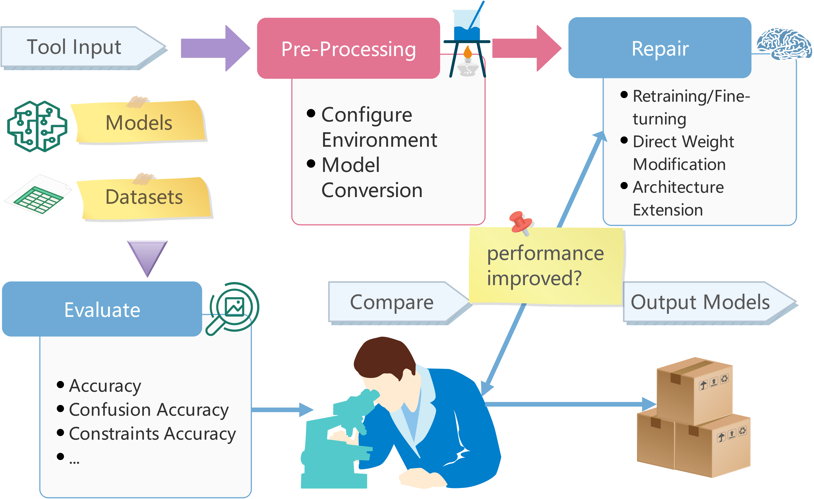

# AIR

Neural Network Repairing Framework

## Overview

This repository contains artefacts that accompany the paper titled [AIREPAIR: A Repair Platform for Neural Networks
 (arXiv preprint)](https://arxiv.org/pdf/2211.15387.pdf). The following diagram shows the architecture of our framework.



## Installation

Use anaconda.sh to install anaconda and setup.sh tp configure the environment of repairing.

```bash
./anaconda.sh
./setup.sh
```
You could also configure the running environment manually, or use python virtual env. 

## Dataset

The following table shows the details of datasets and benchmarks supported and tested by the framework. For the ResNet model, we trained the baseline and performed model repair on CIFAR-10 and CIFAR-100 respectively.

| Dataset Name  | Models    | Type | Scale                                           |
|---------------|-----------|------|-------------------------------------------------|
| ACAS Xu       | 36 unsafe | FFNN | 5 inputs, 6 layers, 300 neurons,5 outputs       |
|               | 9 safe    | FFNN | 5 inputs, 6 layers, 300 neurons 5 outputs       |
| CIFAR-10/100  | ResNet18  | CNN  | 32*32 inputs, 18 layers deep, 10/100 outputs    |
|               | ResNet34  | CNN  | 32*32 inputs, 34 layers deep, 10/100 outputs    |
|               | ResNet50  | CNN  | 32*32 inputs, 50 layers deep, 10/100 outputs    |
| MNIST/F-MNIST | CNN       | CNN  | 28*28 input, 6 conv layers, 10 output           |
|               | FFNN      | FFNN | 28*28 input, 6 layers, 784 per layer, 10 output |
| Credit        | FFNN      | FFNN | 6 layers FFNN                                   |
| Bank          | FFNN      | FFNN | 6 layers FFNN                                   |
| Census        | FFNN      | FFNN | 6 layers FFNN                                   |

## Usage

Firstly please train the baseline models.
```bash
python train_baseline.py --net_type nettype --dataset dataset --saved_path path
```
+ nettype The structure and the neuron type in the model. You can choose: ResNet, MNIST and F-MNIST. For ResNet models, it will train ResNet18, ResNet34 and ResNet50.

+ dataset The dataset used to train the model. Currently ACAS Xu, MNIST, F-MNIST, CIFAR-10 and CIFAR-100 are available.

+ saved_path The folder that you save the trained models, which will be used in repairing later.

Example: 

```bash
python train.py --tool deeprepair --net_type resnet --dataset cifar10 --depth 18
```

Then check the performance of the pretrained model, convert the models, and apply repairing.

```bash
python AIRepair.py --net_type nettype --dataset dataset --pretrained path --log_path path --depth depth
```
Currently the compare.py will compare the repair performance of dl2, deeprepair and apricot running on the same pretrained model. Later we will make it support more repairing tools and frameworks.

+ nettype The structure and the neuron type in the model. You can choose: ResNet, MNIST and F-MNIST.

+ dataset The dataset used to train the model. Currently ACAS Xu, MNIST, F-MNIST, CIFAR-10 and CIFAR-100 are available.

+ pretrained The folder where your pretrained model located, as well as the checkpoint files.

+ depth The number of the layers in your pretrained model, this parameter only works for ResNet models.

+ log_path The folder where you save the generated logs during repairing.

Example:

```bash
python AIRepair.py --net_type nettype --dataset cifar10 --pretrained ./trained_models/resnet_cifar10 --log_path ./logs/repair_resnet_cifar10 --depth 18
```

You could also run the repairing manually, please check the instruction inside each tool's repo.

Although evaluate model has been integrated into compare.py, you can also check the pretrained models and repaired models manually.

Example:

```bash
python AIRepair.py  --net_type resnet --dataset cifar10 --batch_size 256 --workers 4 --lr 0.1 --depth 18 --pretrained ./CSimilarityT.pt --checkmodel
```


## Contributing
Pull requests are welcome. For major changes, please open an issue first to discuss what you would like to change.

Please make sure to update tests as appropriate.

## License
[MIT](https://choosealicense.com/licenses/mit/)
